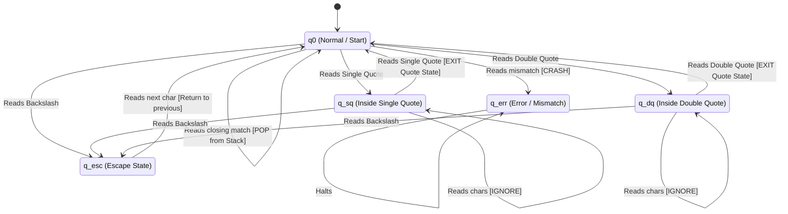

# Theoretical Implementation of Pushdown Automaton (PDA)

## 1. Overview: Why a PDA?
A malicious payload or script is fundamentally a string constructed under a grammatical set of rules. Simple patterns (like `admin` or `.exe`) can be matched by **Finite State Automata (DFA)** through Regular Expressions. However, checking if a payload has correctly nested brackets or properly terminated quotes requires counting and structural awareness.
This requires parsing a **Context-Free Grammar (CFG)**, which can only be done using a **Pushdown Automaton (PDA)** because it includes a **Stack** memory structure.

In `detector.c`, the function `check_payload_pda` utilizes structural parsing to identify malformed, highly obfuscated payloads (like heavily nested brackets or unbalanced tokens used to evade primitive security scans).

---

## 2. Formal Machine Definition
A Pushdown Automaton is formally defined as a 7-tuple:
$$ M = (Q, \Sigma, \Gamma, \delta, q_0, Z_0, F) $$

Mapping this to our C code implementation:

* **$Q$ (Finite Set of States):** Governed by our boolean flags.
  * $q_0$: Initial/Normal state (`in_single_quote = 0`, `in_double_quote = 0`, `escaped = 0`).
  * $q_{sq}$: Inside single quote (`in_single_quote = 1`).
  * $q_{dq}$: Inside double quote (`in_double_quote = 1`).
  * $q_{esc}$: Escape character activated (`escaped = 1`).
  * $q_{err}$: Rejection state (`mismatch = 1`).
* **$\Sigma$ (Input Alphabet):** The ASCII characters of the payload string.
* **$\Gamma$ (Stack Alphabet):** The structural characters we care about: `{ ( , { , [ }` plus the empty stack base $Z_0$.
* **$\delta$ (Transition Function):** The parsing rules defining when to push to the stack, pop from the stack, or change state (detailed below).
* **$q_0$ (Start State):** The parser starts at index 0 in state $q_0$ with `top = -1`.
* **$Z_0$ (Initial Stack Symbol):** Represented by an empty array where `top == -1`.
* **$F$ (Set of Accepting States):** The payload is deemed "structurally balanced" if it finishes parsing in $q_0$ with an empty stack (`top == -1` and `mismatch == 0`).

---

## 3. Language & Grammar

The CFG Language $L$ that our PDA parses represents **"Structurally Balanced Strings"**.
The simplified Grammar $G$ for this language is:

$$ S \rightarrow (S) \mid [S] \mid \{S\} \mid 'A' \mid "A" \mid SS \mid \epsilon $$
$$ A \rightarrow \text{any character sequence without unescaped quotes matching the boundary} $$

If an attacker sends `$(((base64)))`, it is perfectly balanced. If an attacker's obfuscation payload uses fragmented scripts like `powershell -c (invoke-expression {`, the string breaks the grammar rules. The PDA catches this anomaly.

---

## 4. The Transition Logic ($\delta$) & Stack Operations

The C-code iterates over the input string (the "tape"), reading one symbol $\sigma$ at a time.

### A. State Transitions (Finite Control)
Before taking stack actions, the PDA checks its current state:
1. **Escape State ($q_{esc}$):** If `\`, the PDA enters $q_{esc}$. The very next character is ignored structurally, and the PDA immediately returns to the previous state.
2. **Quote States ($q_{sq}, q_{dq}$):** If the PDA is in $q_0$ and reads `'`, it transitions to $q_{sq}$. Within $q_{sq}$, all brackets `(`, `{`, `[` are treated as literal text and **not** pushed to the stack. The state only returns to $q_0$ when the matching `'` is found natively.

### B. Stack Operations (Memory)
If the PDA is in the normal state $q_0$, it evaluates symbols for stack operations:

* **PUSH Operation:**
  If $\sigma \in \{ '(', '\{', '[' \}$:
  $$ \delta(q_0, \sigma, \text{stack\_top}) \rightarrow (q_0, \sigma\text{stack\_top}) $$
  *Code mapping:* `stack[++top] = c;`

* **POP Operation:**
  If $\sigma \in \{ ')', '\}', ']' \}$:
  The machine peaks at the top of the stack. If the top symbol matches the inverse of $\sigma$ (e.g., `)` expects `(`), it pops the symbol off.
  $$ \delta(q_0, ')', '(') \rightarrow (q_0, \epsilon) $$
  *Code mapping:* `top--;`
  If the top symbol does NOT match (e.g., popping `}` when `(` is on top), the PDA crashes to $q_{err}$ by setting `mismatch = 1`.

---

## 5. Exact Dry Run / Trace Execution

Let's trace the PDA parsing a malicious obfuscated payload snippet:
**Input Payload:** `$( { 'str' } ]` (Notice the mismatching closing bracket)

| Symbol ($\sigma$) | State (Before) | Operation / Transition | Action | Stack Content (Bottom to Top) |
|---|---|---|---|---|
| `$` | $q_0$ | Ignore (litreal) | None | Empty (`top = -1`) |
| `(` | $q_0$ | $\sigma$ is open parenthesis | PUSH | `(` |
| ` ` | $q_0$ | Ignore | None | `(` |
| `{` | $q_0$ | $\sigma$ is open brace | PUSH | `(`, `{` |
| ` ` | $q_0$ | Ignore | None | `(`, `{` |
| `'` | $q_0$ | Boundary encountered | State -> $q_{sq}$ | `(`, `{` |
| `s` | $q_{sq}$ | Ignored inside quote | None | `(`, `{` |
| `t` | $q_{sq}$ | Ignored inside quote | None | `(`, `{` |
| `r` | $q_{sq}$ | Ignored inside quote | None | `(`, `{` |
| `'` | $q_{sq}$ | Boundary encountered | State -> $q_0$ | `(`, `{` |
| ` ` | $q_0$ | Ignore | None | `(`, `{` |
| `}` | $q_0$ | $\sigma$ is close brace | POP matches `{` | `(` |
| ` ` | $q_0$ | Ignore | None | `(` |
| `]` | $q_0$ | $\sigma$ is close bracket | POP `]` does NOT match `(` | **CRASH -> $q_{err}$** |

### 6. Resolution & Output
At the end of the scan, the PDA evaluates its acceptance condition:
```c
if (mismatch || top != -1 || in_single_quote || in_double_quote)
```
Because the trace crashed to the error state (`mismatch = 1`), the PDA successfully identifies that the payload has **"Unbalanced Delimiters"** (a strong indicator of payload obfuscation or fragment injection) and assigns malicious scoring points.

## 7. Deep Dive: Grammars, Literals, and the "A" Rule

### What is a "Literal"?
In programming, a **literal** is just raw text data. For example, in the code `print("hello (world")`, the chunk `hello (world` is a string literal.
Even though there is a parenthesis `(` inside it, you **do not** need a closing `)` for it, because that parenthesis is trapped inside quotes. It is legally just raw text, not a structural bracket.

### What are "States"?
Think of a "state" as the **current mode** or **mentality** of our parser:
*   **Normal Mode ($q_0$)**: The parser is actively checking structure. If it sees a bracket like `{` or `[`, it pushes it to the stack.
*   **Quote Mode ($q_{sq}$ or $q_{dq}$)**: The parser just read a quote mark (like `'` or `"`). It temporarily disables its structural checking. It treats everything it reads as pure, harmless text until it finds the closing quote.

### What does "A" mean in the Grammar?
$$ A \rightarrow \text{any character sequence without unescaped quotes} $$
The rule **$A$** is how the theoretical grammar represents **Quote Mode**.
When the grammar generates `"A"`, the $A$ acts as a massive sponge. It absorbs all characters—including brackets and parentheses—meaning they are just treated as part of the raw text blob, completely bypassing the normal rules that demand brackets must be closed.

### Step-by-Step Grammar Dry Run
Let's see how the grammar generates an obfuscated but structurally balanced payload: `({ "a(b" })`. Notice the unclosed `(` hidden inside the quotes.

| Step | Current Form | Rule Applied | What is happening? |
|---|---|---|---|
| 1 | **$S$** | (Start) | We begin with $S$, representing the abstract concept of a balanced string. |
| 2 | `(`**$S$**`)` | $S \rightarrow (S)$ | We expand the payload out. The core must still be balanced ($S$), surrounded by parentheses. |
| 3 | `({`**$S$**`})` | $S \rightarrow \{S\}$ | We expand the inner $S$ into curly braces. We now have `({` on the left and `})` on the right. |
| 4 | `({"`**$A$**`"})` | $S \rightarrow "A"$ | The innermost $S$ becomes a quoted block. We have officially entered Quote Mode ($A$). |
| 5 | `({"a(b"})` | $A \rightarrow a(b$ | The $A$ "sponge" absorbs the literal text `a(b`. Because this `(` was generated inside $A$, it is just raw text. It does not need a closing `)`. |

Because we successfully transformed the valid Start symbol ($S$) into our exact string `({ "a(b" })` using *only* legal rules, the string is entirely balanced!

## 8. The Full Pipeline: How the Stack and Tokens Work Together

A common misconception is that words or tokens (like `powershell` or `http://`) go into the PDA stack. **They do not.**

The detection pipeline in `detector.c` (`check_payload_pda`) operates in three distinct phases.

### Phase 1: The Stack (Structural Analysis via PDA)
**What goes into the stack?** ONLY structural opening brackets: `(`, `{`, and `[`.
The PDA's *only* job is to look at the skeleton of the payload to see if it is malformed (unbalanced) or highly suspicious (Deep Nesting > 4 layers). Letters, numbers, and tokens like `powershell` are completely ignored by the stack—they just pass by as normal characters.

### Phase 2: The Turing Machine (De-obfuscation)
Attackers try to hide tokens by breaking them up, e.g., `p^o^w^e^r^s^h^e^l^l` or `wget""`. The TM rewrites the string in-memory, stripping out `^`, empty quotes `""`, or backticks ``` `` ``` so that the string becomes readable again.

### Phase 3: The Dictionary Search (DFA / Tokens)
Once the string is structurally validated and de-obfuscated, the program uses a standard search (Finite Automata) to check if the cleaned string contains any predefined dictionary words from:
*   `execution_tokens` (e.g., `powershell`, `cmd.exe`)
*   `network_tokens` (e.g., `http://`, `bit.ly`)
*   `injection_tokens` (e.g., `union select`)

---

### End-to-End Example Dry Run
**Malicious Payload:** `( { p^o^w^e^r^s^h^e^l^l -c "malware.exe" } ]`

#### Step 1: The PDA scans for structure
The PDA reads left to right. It ignores the letters completely for stack operations.
1. Reads `(` $\rightarrow$ PUSH `(` to stack. (Stack: `(`)
2. Reads `{` $\rightarrow$ PUSH `{` to stack. (Stack: `(`, `{`)
3. Reads `p^o^w...` $\rightarrow$ Ignore structurally.
4. Reads `"` $\rightarrow$ Enter Quote State ($q_{dq}$). Ignore everything inside the quotes.
5. Reads `"` $\rightarrow$ Exit Quote State.
6. Reads `}` $\rightarrow$ POP matching `{`. (Stack: `(`)
7. Reads `]` $\rightarrow$ POP... Wait! `]` does not match `(`.
**Result:** The PDA crashes and flags **"Unbalanced Delimiters" (+35 Score)**.

#### Step 2: The TM cleans the tape
The string is passed to `run_tm_deobfuscator()`.
The TM scans for the `^` symbol and deletes it recursively.
**Result:** The tape is rewritten to: `( { powershell -c "malware.exe" } ]`

#### Step 3: Execution Tokens are checked
Now that the string is clean, the code checks our token arrays:
```c
count_token_hits(lower, execution_tokens, ...);
```
It scans `( { powershell -c "malware.exe" } ]` and finds the exact word `"powershell"`, which is inside our `execution_tokens` array.
**Result:** The system flags **"Execution Token Detected" (+15 Score)**.

### Summary of the Mechanism
1. The **PDA Stack** catches the structurally broken anomaly at the end (`]`).
2. The **TM** strips the caret (`^`) camouflage.
3. The **Tokens list** catches the underlying `"powershell"` script.

## 9. PDA State Machine Diagram

Below is the visual representation of the PDA's state transitions, operating exactly like the DFA/NFA state diagrams from computation theory.



### Understanding the Diagram:
* **`q0` (The Engine):** This is where the actual Push/Pop stack logic happens.
* **`q_sq` & `q_dq` (The Sponges):** This represents the Non-Terminal $A$, where the PDA completely turns off its stack mechanism and safely loops over raw text until it hits a matching closing quote.
* **`q_esc`:** A temporary hop state that consumes the immediate next character, preventing things like `\"` from accidentally closing a string.
* **`q_err`:** The "trap" state. If the string tries to POP a bracket but the stack doesn't match, it gets thrown here and safely flags the payload as potentially malicious (Unbalanced Delimiters).

## 10. C Implementation Details: Translating Theory to Code

In theoretical textbooks, PDAs are abstract mathematical concepts. In `detector.c`, we bring this to life using standard imperative programming constructs, mapping the theoretical architecture directly to lightweight variables.

### 1. The Stack ($\Gamma$)
The infinite memory of the PDA is simulated using a fixed-size C-array and an integer pointer (`top`):
```c
char stack[INPUT_SCAN_LIMIT];
int top = -1;  // -1 represents the Empty Stack (Z0)
```
*   **PUSH:** When we see `(`, we increment `top` and assign the value to the array: `stack[++top] = c;`
*   **POP:** When we successfully match `)`, we simply decrement the pointer to forget the top element: `top--;`

### 2. The States ($Q$)
Instead of complex state objects, the finite control states are represented by simple boolean integer flags:
*   `int in_single_quote = 0;` (Represents $q_{sq}$)
*   `int in_double_quote = 0;` (Represents $q_{dq}$)
*   `int escaped = 0;` (Represents $q_{esc}$)
*   `int mismatch = 0;` (Represents the crash/error state $q_{err}$)

If all structural flags are `0`, the machine is essentially in $q_0$ (Normal State).

### 3. The Tape and Transitions ($\delta$)
The input string acts as the "tape", and the machine reads it one character at a time using a standard `for` loop. The transition function ($\delta$) is just a strictly ordered sequence of `if / else` blocks.

Here is the condensed core PDA loop mapped directly from `detector.c`:

```c
for (int i = 0; input[i] && i < INPUT_SCAN_LIMIT - 1; i++) {
    char c = input[i];

    // Transition: Escaping (q_esc)
    if (!escaped && c == '\\') {
        escaped = 1; // Enter q_esc temporarily
        continue;    // Skip to next character immediately
    }

    // Transition: Toggle Quote States (q_sq, q_dq)
    if (!in_double_quote && c == '\'' && !escaped) {
        in_single_quote = !in_single_quote; // Flip q_sq flag
    } else if (!in_single_quote && c == '"' && !escaped) {
        in_double_quote = !in_double_quote; // Flip q_dq flag
    }

    // Transition: Normal State (q_0) Logic 
    // ONLY check brackets if we are NOT inside a Quote State Sponge
    if (!in_single_quote && !in_double_quote) {
        
        // PUSH Logic
        if (c == '(' || c == '{' || c == '[') {
            stack[++top] = c; 
        } 
        
        // POP Logic
        else if (c == ')' || c == '}' || c == ']') {
            // Determine what the stack SHOULD have on top
            char expected = (c == ')') ? '(' : (c == '}') ? '{' : '[';
            
            // Trap to q_err if stack is empty or top doesn't match
            if (top < 0 || stack[top] != expected) {
                mismatch = 1; 
            } else {
                top--; // Successful POP
            }
        }
    }
    
    escaped = 0; // Always exit q_esc on the next valid character
}
```

### The Beauty of this Implementation
By mapping abstract mathematical state changes to literal boolean flags and `if` execution paths, the program securely validates deeply complex payload grammars in exactly $O(n)$ time complexity, reading each character from the input tape exactly once.
